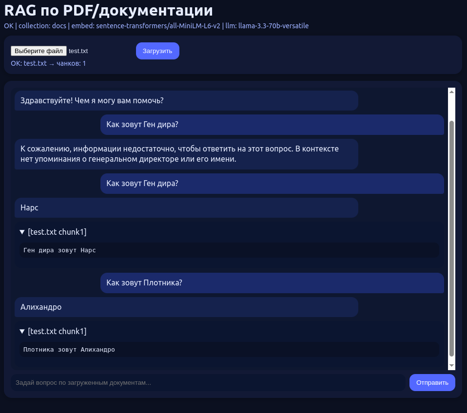

# RAG по PDF/Документации

Этот проект реализует систему поиска и ответа на вопросы по PDF-файлам и другим документам с помощью **RAG (Retrieval-Augmented Generation)**.  
Пользователь загружает документ, система разбивает его на чанки, индексирует в векторное хранилище и позволяет задавать вопросы по содержимому через чат-интерфейс.

---

## 🚀 Основной стек технологий
- **FastAPI** — backend API для загрузки файлов и обработки запросов.  
- **LangChain** — связка для работы с LLM, ретривером и цепочками вопросов-ответов.  
- **ChromaDB** — векторное хранилище для эмбеддингов документов.  
- **Groq API** — использование LLM для генерации ответов.  
- **Sentence-Transformers** — создание эмбеддингов для чанков текста.  
- **pypdf / docx2txt** — парсинг документов (PDF, DOCX).  
- **HTML + CSS + JS** — простой фронтенд с чатом и загрузкой файлов.  
- **Docker** — контейнеризация и запуск проекта.

---

## 📸 Скриншот интерфейса
Пример работы (загрузка документа и чат с моделью):



---

## 🔧 Как запустить
1. Клонировать репозиторий  
   ```bash
   git clone git@github.com:MagomedDr/Rag_PDF.git
   cd Rag_PDF
   docker-compose up -d
   ```